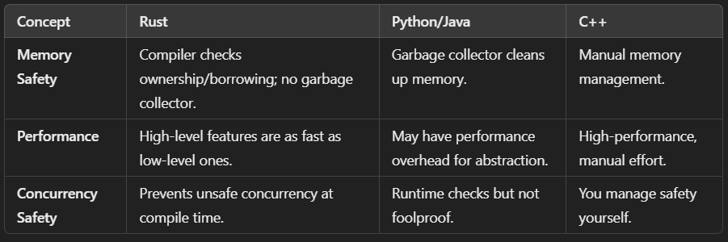
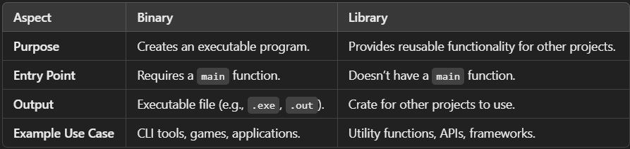

# RUST
Rust is a powerful, performance-oriented, and memory-safe programming language. It’s known for its robust type system and fearless concurrency.
- Memory Safety Without Garbage Collection: Rust ensures memory safety through ownership and borrowing rules.
- Zero-Cost Abstractions: High-level abstractions don’t come with runtime overhead.
- Concurrency Without Fear: Rust prevents data races at compile time.

## Rustup
Recommended tool for managing rust versions & associated tools

## Ownership, Borrowing & Lifetimes
- **Ownership**: Each value has a single owner, and when the owner goes out of scope, the value is dropped.
- **Borrowing**: References to values can be borrowed without transferring ownership.
- **Lifetimes**: Ensure references are valid for their intended scope.

## Common Rust Features
- structs
- enums & pattern matching
- traits (Rust's version of interfaces)

## Memory Management
Rust doesn’t use a garbage collector. You'll need to:
- Use smart pointers like _Box, Rc, and RefCell_.

## Error Handling
_Result_ and _Option_ enums are used instead of exceptions.

## Cargo & Crates
- _cargo_ - Rust's package manager & build system
- _crates_ - Rust's term for packages

## Tools
- Clippy: Linter for catching common mistakes.
    > cargo install clippy
    > cargo clippy
- Rustfmt: Formatter for keeping your code tidy.
    > cargo fmt
- Documentation: Automatically generate docs
    > cargo doc

## Types of projects - Binaries & Libraries

## Memory Management
Allocating & Deallocating Memory 
- Stack
    - Data whose size can be determined during compile time goes into stack, i.e static
    - Smaller in size
    - Faster
    - Used for small, fixed-size variables and function call information (eg. numbers, booleans, fixed size arrays, structs, references)
- Heap
    - For dynamic memory allocation, allocated at run time
    - Much larger in size
    - Slower due to dynamic allocation and deallocation
    - Used for dynamic and large data structures that can't fit in stack (eg. strings, vec, hasmap, box)

How memory management happens?
- Garbage collector
    - written by smart people
    - usually no dangling pointer/memory issue
    - can't do manual memory mgt.
    - eg. java, js
- Manual
    - you allocate & deallocate memory yourself
    - can lead to dangling pointers/memory issue
    - learning curve is high since you have to do manual mem. mgt.
    - eg. C
- The rust way
    - rust has it's own ownership model for memory mgt.
    - makes it extremely safe to memory

## Ownership
- Prevents memory leak/issues
- Each value in rust has an owner
- There can only be one owner at a time
- When the owner goes out of scope, the value will be dropped
- Basically, every value in heap has a owner in the stack (eg. variable), when the variable goes out of scope, the corresponding value/memory in heap is freed automatically

## Moving
-  Eg. Owner of the string aniket gets moved from variable a1 to a2 (can have only one owner)
    > let a1 = String::from("aniket);
    > let a2 = a1;              // to copy, use a1.clone()
    > println!("{}", a1) -----> Invalid, won't compile
    > println!("{}", a2) -----> aniket

- let say we had a fn print_str(s: String), then
    - let a2 = a1; is same as print_str(a1); // a1 is moved
    - but you can get ownership back by returning the value as well, i.e (assuming a1 is mutable)
    > a1 = print_str(a1)
    > ...
    > fn print_str(a: String) -> String {
        println!("{}", a);
        return a; // moving back ownership
    }

## Borrowing
- Instead of returning value to return ownership, we can use references.
- Eg. 
1. Here, a1 owns the value throughout, and let's the function borrow it using the &
  > let a1 = String::from("aniket);
  > print_str(&a1); // to make it mutable, use &mut a1 instead (NOTE: a1 should be made mut as well then)
  > ...
  > fn print_str(a: &String) -> String { // to make it mutable, use &mut String
    println!("{}", a);
  }
2.  > let a1 = String::from("aniket);
    > let a2 = &a1;              // a1, a2 points to same value, but owner is stll a1
    > println!("{}", a1) -----> valid
    > println!("{}", a2) -----> aniket

- **NOTE**: _At any given point, you can either have one mutable reference or any no. of immutable references_

## Collections
- Data structures
- Can contain multiple values
- Data these collections point to is stored on the heap

### Vectors
- store more than one value in a single DS that puts all values next to each other in memory

### Hashmaps
- stores a key value pair in rust

### Iterators
1. **Iter** : If you want immutable references to the inner variables & don't want to transfer ownership
2. **IterMut** : If you want mutable references to the inner variables & don't want to transfer ownership
3. **IterInto** : If you want to move the variable into the iterator and don't want to use it afterwards (By default)
- **Consuming Adaptors** : Methods that call next are called consuming adaptors, because calling them uses up the iterator
- **Iterator Adaptors** : Methods defined on the iterator trait that don't consume the iterator. Instead, they produce different iterators by changing some aspect of the original iterator.

How do you know if a function is consuming adaptor or iterator adaptor?
- Check the function's definition, if it takes _self_, it's becoming an owner and is a consuming one, if it takes _&self_, it's simply borrowing

## Strings Vs Slices
- **String** type is provided by rust's std. library rather than coded into the core language. It is a growable, mutable, owned, UTF-8 encoded string type. when you create a string, the data gets stored in the heap, and the metadata in stack(pointer, length, capacity).
- **String Slice (&str)** is UTF-8 encoded as well. Slices lets you reference a contiguous sequence of elements in a collection rather than the whole collection. It is a kind of reference, so it does not have ownership.

- _3 types of commonly used strings_
1. let name = String::from("hello world"); // string type
2. let string_slice = &name; // has a view into the original string/is a reference
3. let string_literal = "hello"; // literal is also an &str but it points directly to an address in the binary

## Traits: Defining shared behavior
- similar to interfaces in other languages
- defines the functionality a particular type has & can share with other types
- define shared behavior in an abstract way
- we can use trait bounds to specify that a generic type can be any type that has certain behavior

## Commands
- > cargo init
- > cargo run
- > cargo add <crate_name>
